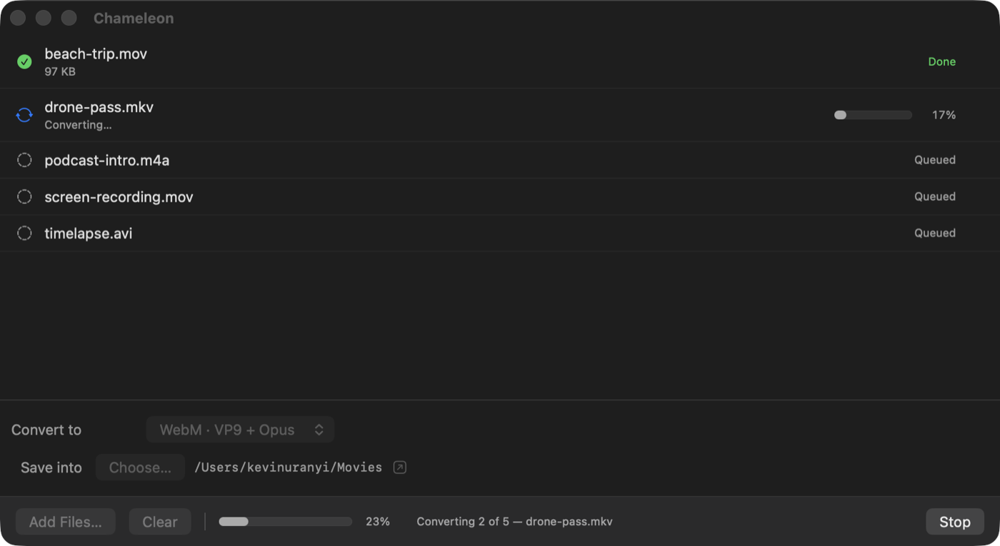

<div align="center">


# Chameleon

**A native macOS app for batch-converting media with ffmpeg.**

Named for the obvious reason: it changes what things look like.

</div>

<div align="center">
  
</div>

## What it is

ffmpeg is the best media converter there is and one of the least pleasant to
use for the simple stuff. Chameleon covers the case you actually reach for
most: *take this pile of files and make them all that format*.

Drop files in, pick a format, pick a folder, hit Convert. That's the app.

## Install

Requires [ffmpeg](https://ffmpeg.org):

```bash
brew install ffmpeg
```

Then build:

```bash
git clone https://github.com/kuranyi/chameleon.git
cd chameleon
./mac/build.sh
```

That produces `~/Applications/Chameleon.app`. No Xcode project, no
dependencies, no package manager — just `swiftc` and the system frameworks.

## Use it

1. **Drag files onto the window**, or hit Add Files… (multi-select with ⌘/⇧)
2. Pick a format under **Convert to**
3. Pick a folder under **Save into**
4. **Convert** — the bottom bar tracks the batch, each row tracks itself

Double-click a finished row to reveal that file in Finder.

## Formats

| | |
|---|---|
| **Video** | MP4, MKV, MOV (H.264 + AAC) · WebM (VP9 + Opus) · GIF (12 fps, 640px) |
| **Audio** | MP3 (V0) · M4A (AAC 192k) · WAV (16-bit) · FLAC · Opus (128k) |

## Behaviour worth knowing

- Originals are never touched, and existing files are never overwritten — a
  collision becomes `name (1).ext`.
- A file that fails doesn't stop the batch; its row shows ffmpeg's own error.
- Asking for audio from a file with no audio track says exactly that, rather
  than passing through ffmpeg's cryptic `Invalid argument`.
- **Stop** kills the running encode and deletes its half-written output.
- ffmpeg is located at launch (`/opt/homebrew/bin`, `/usr/local/bin`, then your
  login shell's PATH). If it's missing, the app says so in a banner instead of
  failing silently.

## Layout

```
mac/
  Sources/
    Models.swift       the format list — each entry is just ffmpeg flags
    Converter.swift    queue, ffmpeg process handling, progress parsing
    ContentView.swift  the window
    App.swift          entry point
  build.sh             compiles and bundles the .app
  make-icon.sh         regenerates the icon
  MakeIcon.swift       the icon, drawn in CoreGraphics
```

### Tuning quality

Every format is a plain list of ffmpeg flags in `allFormats` (`Models.swift`):

```swift
OutputFormat(ext: "mp4", group: "Video", label: "MP4 · H.264 + AAC",
             args: ["-c:v", "libx264", "-crf", "23", ...])
```

Lower `-crf` for better video, change `fps=12,scale=640:-1` for larger or
smoother GIFs. Rebuild with `./mac/build.sh`.

## Notes

The app is ad-hoc signed, not notarized. Built locally it has no quarantine
flag and opens normally — but copied to another Mac, Gatekeeper will block it.

## License

MIT — see [LICENSE](LICENSE).
